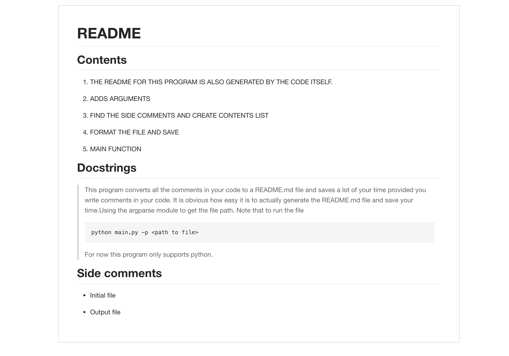
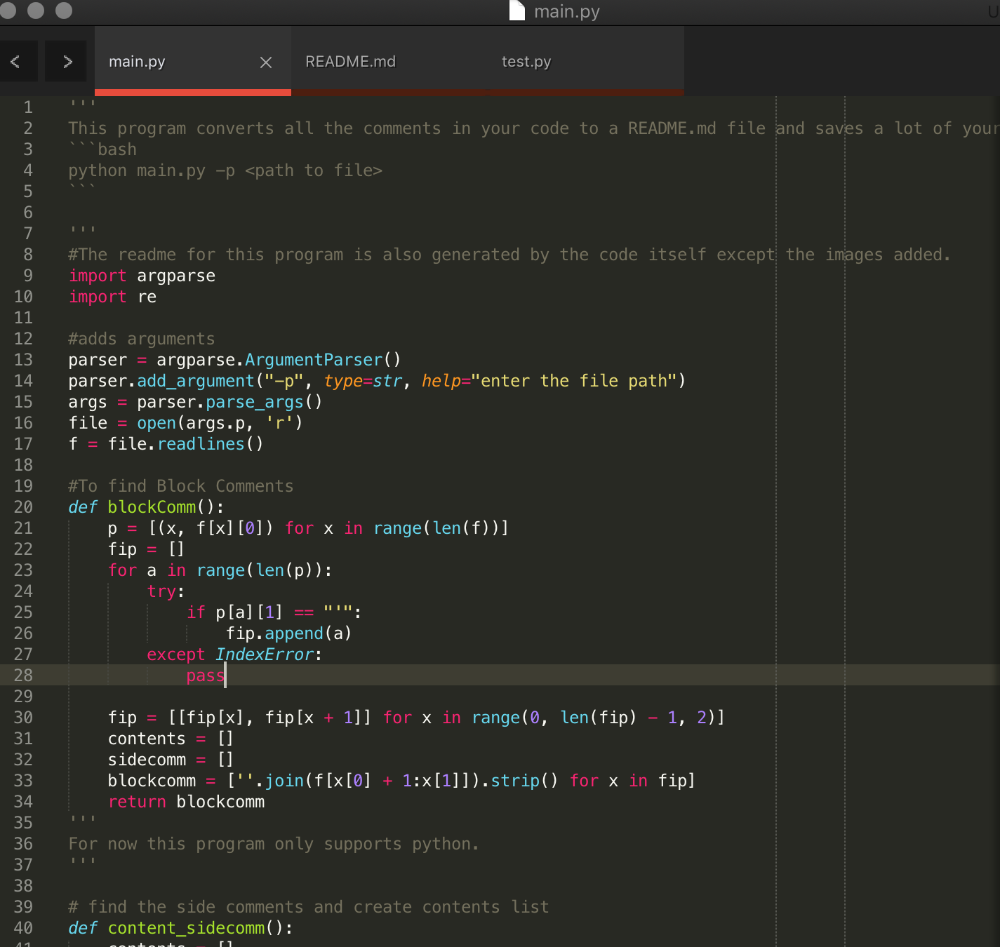

# README
## Contents
1. THE README FOR THIS PROGRAM IS ALSO GENERATED BY THE CODE ITSELF.

2. ADDS ARGUMENTS

3.  FIND THE SIDE COMMENTS AND CREATE CONTENTS LIST

4. FORMAT THE FILE AND SAVE

5.  MAIN FUNCTION

## Docstrings
>This program converts all the comments in your code to a README.md file and saves a lot of your time provided you write comments in your code. It is obvious how easy it is to actually generate the README.md file and save your time.Using the argparse module to get the file path. Note that to run the file
```bash
python main.py -p <path to file>
```
>For now this program only supports python.
## Side comments
- Initial file

- Output file

**GENERATED README**

**INITIAL CODE**


